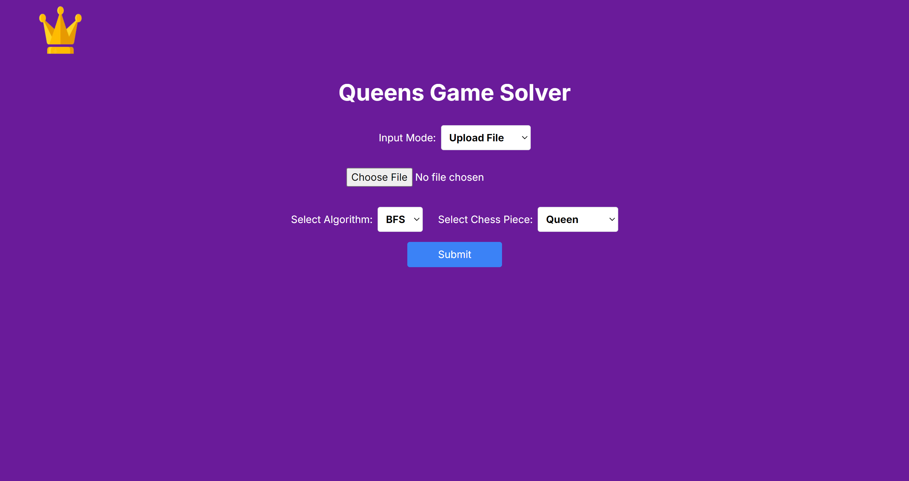

<div align="center">
  
</div>

# 👑 Queen-Game-Solver
## 📝 Application Description
### Overview
Queen-Game-Solver is an interactive application that provides solutions to a variant of the classic N-Queens problem, where the board is divided into color-coded regions, and specific rules determine where queens and other chess pieces can be placed. The application uses recursive algorithms such as BFS (Breadth-First Search) and DFS (Depth-First Search) to find valid solutions. The solutions must obey the constraints of the Queens Game, ensuring that no piece conflicts with others based on standard chess rules and region-based restrictions.

### Application Features
- <b>Algorithm Choice:</b> Implements both BFS and DFS algorithms for finding solutions to the Queens Game. Users can switch between these algorithms via a GUI.
- <b>Board Configuration via File Input:</b> Accepts a .txt file as input, specifying the board dimensions, number of colored regions, and the configuration of the regions
    - <b>First line:</b> dimensions of the board (rows x columns)
    - <b>Second line:</b> number of regions on the board
    - <b>Subsequent lines:</b> configuration of each region with characters representing colors/regions.
    - <b>Interactive GUI:</b> The program features a GUI where users can:
```bash
4 5
3
A A A @ @
A A 2 @ @
A 2 2 2 @
2 2 2 2 @
```


- Load and modify the board dimensions and region configurations.
- Visualize the solution directly on the board after the algorithm is executed.
- Choose the algorithm (BFS or DFS) for solving the puzzle.

### Special Features
- <b>Chess Piece Selection:</b> Users can change the standard queen pieces to other chess pieces, such as Rooks, Bishops, and Knights, each following their unique movement rules:
    - Queen: Cannot share the same row, column, or diagonal with another queen.
    - Rook: Cannot share the same row or column with another rook.
    - Bishop: Cannot share the same diagonal with another bishop.
    - Knight: Must follow the standard L-shaped move restrictions.
- <b>Dynamic Board Modification:</b> Through the GUI, users can dynamically adjust the size and layout of the board, change region colors, and apply new constraints to the pieces, ensuring that the rules remain intact.

## 💻 Tech Stacks
### Programming Language
- Python
- Javascript

### Front-End
- Node.js
- React
- Next.js
- CSS / Tailwind CSS
- React Hooks
- React Spinners

### Back-End
- Flask
- Flask-CORS

## 🗂️ Program Structure
```bash
├── img
├── src
│   ├── backend
│   │   └── app.py
│   └── frontend
│       ├── .next
│       ├── app
│       │   ├── favicon.ico
│       │   ├── globals.css
│       │   ├── layout.js
│       │   └── page.js
│       ├── components
│       │   ├── BoardDisplay.js
│       │   └── FileUpload.js
│       ├── node_modules
│       └── public
│           ├── next.svg
│           ├── Queens-Game-Logo.png
│           └── vercel.svg
├── .gitignore
├── jsconfig.json
├── next.config.mjs
├── package-lock.json
├── package.json
├── postcss.config.mjs
├── README.md
├── tailwind.config.js
└── test
    ├── test1.txt
    ├── test2.txt
    └── test3.txt

```

## 🧙 Algorithms
### BFS (Breadth First Search)
- <b>Usage:</b> BFS is used in scenarios where you need to explore all possible moves layer by layer, ensuring that you find the shortest or most optimal path to the solution. In the context of the Queens Game Solver, BFS can be employed to explore all possible placements of queens on the board level by level, ensuring that all potential configurations are considered.
- <b>Reason:</b> BFS is particularly useful when the goal is to find the shortest path or the least number of moves to a solution. Since BFS explores all nodes at the present depth level before moving on to nodes at the next depth level, it ensures that the first solution found is the optimal one in terms of the number of moves. This makes BFS a good choice when the board is relatively small or when finding the quickest solution is critical.

### DFS (Depth First Search)
- <b>Usage:</b> DFS is used when exploring all possible solutions by going as deep as possible down each branch before backtracking. In the Queens Game Solver, DFS is employed to place queens on the board one by one, exploring all possible configurations until a solution is found or all possibilities are exhausted.
- <b>Reason:</b> DFS is beneficial when the solution requires exploring deep into possible configurations and backtracking when necessary. It’s particularly effective for larger boards where a solution may be far down a particular path. DFS tends to use less memory than BFS because it doesn’t need to store all the nodes at each level. However, it may take longer to find the optimal solution since it doesn’t guarantee the shortest path like BFS does. DFS is ideal for solving puzzles where the goal is to explore as much of the search space as possible, even if the solution is found deep in the tree.

## 🛠️ Configuration Guide
### Front-End Configuration
1. Clone the repository to your local files. Access the repository [here](repository-link).
2. Open the terminal and ensure that the directory is set to `Queen-Game-Solver/src/frontend`.
3. Make sure to install Node.js. You can access the Node.js Installer [here](https://nodejs.org/en/download/package-manager). Make sure to add PATH during installation on your device.
4. Run `npm install` to activate the React-JS framework and any dependencies needed by the website locally.
5. Execute `npm run dev`.

### Back-End Configuration
1. Make sure to install Python Programming Language. You can access the Python Programming Language Installer [here](https://www.python.org/downloads/). Make sure to add PATH during installation on your device.
2. change the directory to `Quuen-Game-Solver/src/backend`.
3. After dependencies are successfully installed, run the backend by executing `python app.py` on the terminal.

## 🏃‍♂️ How To Run
1. Access The Queens Game Solver website page at http://localhost:3000.
2. You can choose the program input by manual input or file input. For manual input you can input row, column and region after that click generate board button. Once the board generated, you can input the region of the board as you desire.
4. Once you click the submit button, you can see the solution of the Queens Game from the GUI.

## 📸 Screenshots
<div align="center">
  
  <p><i>Home Page</i></p>
</div>
<div align="center">
  
  <p><i>Simulate Board</i></p>
</div>
<div align="center">
  
  <p><i>Queens Solution</i></p>
</div>
<div align="center">
  
  <p><i>Knight Solution</i></p>
</div>

## 📚 Reference
- https://www.linkedin.com/games/queens/
- https://informatika.stei.itb.ac.id/~rinaldi.munir/Stmik/2020-2021/BFS-DFS-2021-Bag1.pdf
- https://informatika.stei.itb.ac.id/~rinaldi.munir/Stmik/2020-2021/BFS-DFS-2021-Bag2.pdf
- https://www.geeksforgeeks.org/breadth-first-search-or-bfs-for-a-graph/ 
- https://www.geeksforgeeks.org/depth-first-search-or-dfs-for-a-graph/